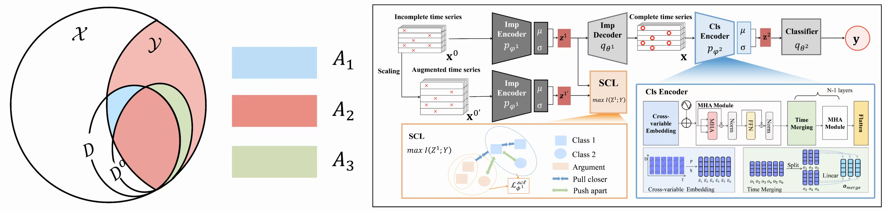

# **Loss or Gain: Hierarchical Conditional Information Bottleneck Approach for Incomplete Time Series Classification (KDD 2025)**

We propose a Hierarchical Conditional Information Bottleneck (HCIB) framework, which achieves incomplete time series classification through end-to-end joint optimization. Specifically, at the data imputation level, we re-examine the dual effects of missing data: the loss of critical information (Loss) versus the gain in interference suppression (Gain), elucidating this duality through bias-variance trade-off theory. Building on this analysis, we propose a task-information sufficiency criterion and extend the information bottleneck theory into a task-driven imputation framework by incorporating label information as a conditional constraint. At the feature representation level, we construct a hierarchical information bottleneck architecture to learn compressed yet informative temporal representations from the task-oriented imputed data. Furthermore, we derive the optimizable objective function for HCIB and design specialized neural network architectures for time series. 




## Usage

1. Install Python 3.8. For convenience, execute the following command.

```
pip install -r requirements.txt
```

2. Prepare the data. You can obtain the UEA datasets with different missing rates from [[Baidu Drive]](https://pan.baidu.com/s/1nwW1TkM2eiRGl-0le2_NPA?pwd=7844 ), then place the downloaded data in the `./dataset` folder.
3. Train and test the model on UEA datasets with different missing rates using the `--dataset` and `--m` parameters:

```
python main.py --dataset JapaneseVowels --m 0.7
```


## Citation

If you find our work is useful in your research, please consider  citing:

```
@article{zhang2025kdd,
  title={Loss or Gain: Hierarchical Conditional Information Bottleneck Approach for Incomplete Time Series Classification},
  author={Shuo Zhang and Jing Wang and Shiqin Nie and Jinghang Yue and Weikang Zhu and Youfang Lin},
  year={2025}
}

```


## Thanks for the code provided by:

- TimeMIL: https://github.com/xiwenc1/TimeMIL/tree/main
- TimeCIB: https://github.com/Chemgyu/TimeCIB
- Time-Series-Library: https://github.com/thuml/Time-Series-Library/tree/main

- Classification: https://www.timeseriesclassification.com/.
- AJRNN: https://github.com/qianlima-lab/AJ-RNN
- Raindrop: https://github.com/mims-harvard/Raindrop


